# Vectorworks Technical Guide

*Standards and procedures for day-to-day CAD production at an Architecture Firm.*

This guide covers the recurring, easy-to-forget procedures for working inside the firm's Vectorworks project setup — from opening a shared project for the first time through the symbol and title-block conventions used on every sheet. It assumes you're working inside an existing project template; for how a project gets set up in the first place, see the companion [Project Sharing & Version Control Concepts](project-sharing-workflow.md) guide.

---

## Admin: Setup a New Project

This is an admin-level process for new projects. This assumes the new project has been created from the project template folder. After the first time this process is run, do not repeat it.

1. Open Vectorworks.
2. Open the `ProjectName.vwx` file.
3. Rename it to the actual project name, if that hasn't already been done.
4. Select **File > Project Sharing**. (If you don't see this option, you'll want to temporarily change your Workspace to Architect or add the option to your setup.)
5. Project Sharing Setup:
   1. Select **Project Sharing Server** (then wait, as this can take a minute).
   2. URL: `http://cad-server.example.local:22001`. This may take a little while — if you receive an error, check the server address and that the server machine is switched on and connected to your network.
   3. You will now see any folders and project files that already exist on the server.
   4. Go to the project's folder for Vectorworks drawings.
   5. Double check that the project file name is correct.
   6. Click **OK**.
6. Click **Next**.
7. Change the default permission for new users to **Admin** and click **Next**.
8. Skip the Classify Layers options by clicking **Next**.
9. Change the numbers for the backup policy to 5 commits and keep the 5 most recent backups. The backup folder remains as the default.
10. Click **Finish**.
11. Vectorworks will now save the project file to the server and open a working file with your name.
12. Save the working file to your computer.
13. Skip the next section, as you already have a working file.

## Working Files and Server Files

Vectorworks has a project file that is saved on the server. You will not be editing this file directly. Instead, you will make a working copy that is saved on your computer. After the first time you create a working file, you do not need to repeat this process — simply open your working file and begin work. If you wish to learn more about how the working files and server files coexist, see the [Project Sharing & Version Control Concepts](project-sharing-workflow.md) guide.

> **Note:** Some of the old projects weren't converted over to the server/working-file system, because they were closed prior to the firm's adoption of this method. If a file on the server ends in `.vwx`, you may open the file directly.

### New Working Files

1. Open Vectorworks.
2. Select **File | Open**.
3. Navigate to the project (`.vwp`) file on the server.
4. Select it and press **Open**. Your working file will be automatically created.
5. Save this file to your computer. It will have a `.vwxw` extension and be listed as a Vectorworks Working File type.

#### Older Projects

In the summer of 2025, Vectorworks changed how to open project files. If the above method doesn't work, you'll have to use this older process to create a working file.

1. Open Vectorworks.
2. Select **File | Open Project Sharing Server File**.
3. A window will appear with the following info. (If it doesn't, type in the URL shown below.)

   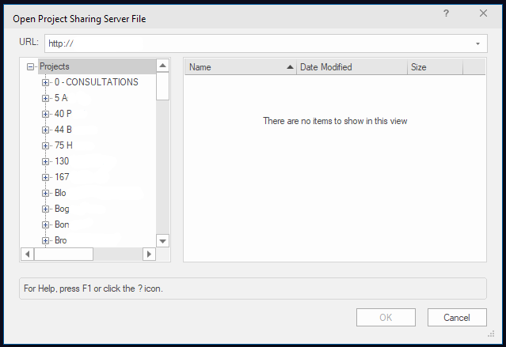

4. Navigate to the *Project Folder/Project CAD/Project Vectorworks files/* folder.
5. Select the `Project.vwxp` file on the right.
6. Press **OK**. Your working file will be automatically created.
7. Save this file to your computer. It will have a `.vwxw` extension and be listed as a Vectorworks Working File type.

## Notes about Automation

Most of the changes to the firm's workflow have to do with taking advantage of the automations Vectorworks provides. Objects like drawing labels, section markers, and title blocks are not edited directly — more often than not, they are *not* editable by double-clicking on them. Instead, select the object and look at the Object Info panel. What you're wanting to change is either locked for style purposes or easily editable there.

The project folder contains AB, SD, and CD sheets with title blocks that already have the correct information for their corresponding sheet. The design layers are set up with the firm's typical areas of interest — add, edit, or delete these to meet individual project needs (see the firm's Vectorworks admin guide for more on how). The classes are set up with the typical ones the firm uses, and are editable.

## Setup for New Projects

This is not the technical setup of creating a new project and its file structure — for those steps, refer to the IT manual.

### Project and Client Data Setup

1. Open your working file.
2. Go to any of the existing sheets and select the title block.
3. Press the **Project Data** button in the Object Info panel (it's a button at the bottom right).

   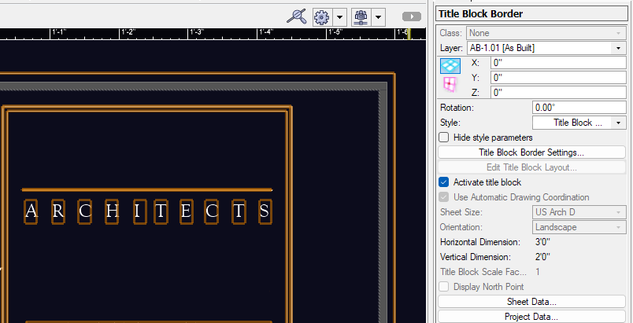

4. Update the Project Name with the client's name (ALL CAPS), project address, and project type (the drop-down box shown below).
5. Press **OK**.

   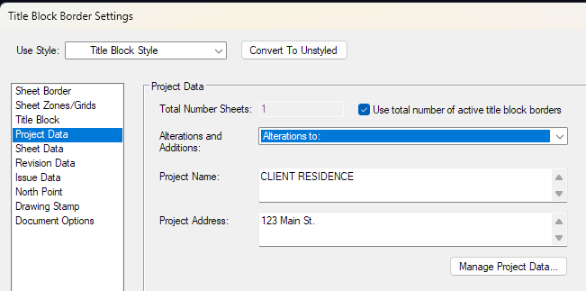

### North Arrow Setup

1. Click on the North Arrow layer under `-----Resources-----` in the Design Layers tab.
2. Read the notes on the design layer for how to update the compass rose so north points in the appropriate direction for your project.

## Working with Sheets — General Information

### Creating a New Sheet

While there are several ways to create a new sheet, this method keeps all the settings intact. Please don't edit the template directly.

1. In the Sheet Layers tab, select the appropriate template:
   - Select `Template-SD` for SD sheets.
   - Select `Template-CD` for CD or As-Built sheets.
2. Right-click on the selected template.
3. Click **Duplicate**.

   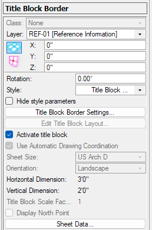

#### Updating the Sheet Information

1. Select the title block on the new sheet.
2. Press the **Sheet Data** button on the Object Info panel.
3. Type in the new sheet title and number.
4. Type in the date you want displayed on the sheet, in the *Month Date, Year* style (example: *January 1, 2027*).
5. Select the correct sheet scale from the drop-down menu (additional scales can be added — see your firm's Vectorworks admin guide).
6. Press **OK**.

#### Adding a Sheet Scale Symbol

Necessary unless the sheet scale is N.T.S. or As Noted.

1. Select the Symbol Insertion Tool.

   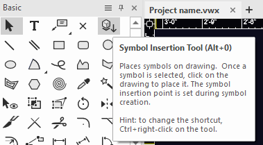

2. Press the dropdown arrow next to **Select a Symbol Definition**.

   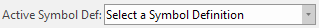

3. Select the appropriate scale for your sheet.
4. Press **Select**.

   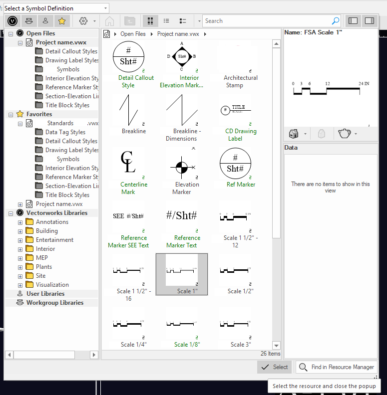

5. Click once on the locus below the scale on your sheet.

   

6. Move your mouse to the right horizontally and click to place the scale symbol.

#### Move the Sheet

Drag & drop the new sheet (or any other method you prefer) to the correct order within the existing sheets.

## SD Files

### Adding the Sheet Number

The firm numbers SD sheets with the same number for one design option. Because of the way Vectorworks calculates sheet numbers, they have to be unique.

The work-around is to place a space in front of the page number if there is more than one sheet — for example: `SD-2`, `_SD-2`, `__SD-2` for three sheets.

## CD Files

### Adding Revision (Issue) Information

Double-click the title border on the sheet to access the Title Block Border Settings. On the left, you'll see Revision Data and Issue Data.

> **Do not use Issue Data** — Vectorworks isn't smart enough to know that an issue and a revision are the same thing to the firm. We had to pick one to use, and Revision Data was it.

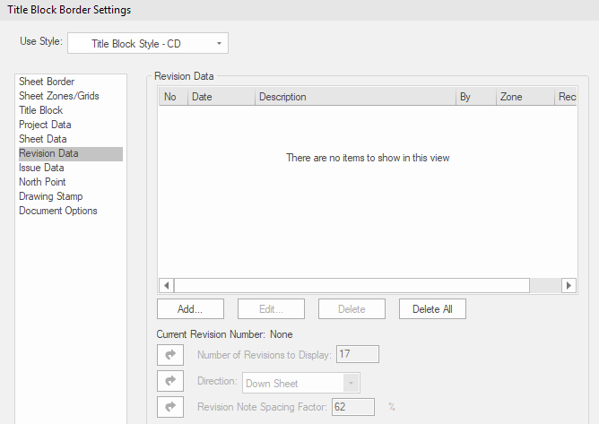

1. Press the **Add…** button.

   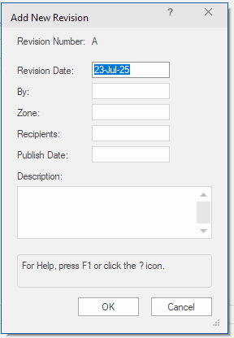

2. Enter the date the sheet will be issued in the **Revision Date** field. The format is `DD MON YY` (example: `05 JUN 27`).
3. In ALL CAPS, put the revision information in the **Description** box.
4. Press **OK**.
5. Press **OK**.

The information is added to the sheet and is available for the Drawing List.

## Appendix A — Title Blocks

There are several title blocks in the project resources. Each relates to the phase of the project — AB, SD, and CD. They are all on Arch D sized paper.

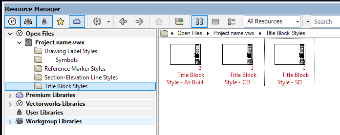

### Changing the Title Block

If your sheet already has a border that needs to change, you may either:

#### Delete and Replace

1. Select then delete the title block border.
2. From the Resource Browser, double-click on the one you want to place, then click on the sheet — or double-click the "Title Block Border Tool" in the Tool Sets panel, select the correct border style in the dropdown box, then click on the sheet to place.

#### Update the Current Border

1. Select the title block border.
2. Look at the Object Info panel and select the dropdown for Style.

   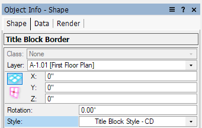

3. Select **Replace**.
4. Press the dropdown arrow button.
5. Choose the new title block border.
6. Press **OK**.

#### Adding the Architect Stamp to the Title Block Area

1. Select the Symbol Insertion Tool.

   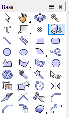

2. At the top of the drawing area, use the dropdown to "Select a Symbol Definition."

   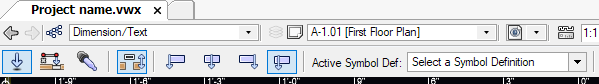

3. At the top of the list for your drawing should be the FirmName Architectural Stamp. Double-click to select it.

   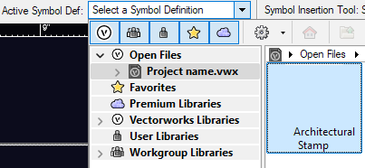

4. Click once on the sheet for an insertion point, then another to the right horizontally (because VW can rotate symbols).

### Drawing List aka Sheet Index

In new projects, the Drawing List is automatically generated. This describes how that works and things you might want to know.

#### Borders

Unfortunately, Vectorworks does not allow for double-line borders on worksheets. There are two rectangles around the drawing list worksheet. When the drawing list is updated, you'll need to resize the rectangles.

#### Updating the Drawing List

To update the drawing list, right-click on it and select "Recalculate Selected Worksheet." This re-runs the search and will add/delete items from the list.

#### Exclude a Sheet from the Drawing List

If you want to exclude a sheet from the drawing list, type an `X` in front of the sheet number.

#### Behind the Scenes

The drawing list displays sheets based on search criteria. The first thing it looks for is in the sheet number — does it begin with `A-` or `E-`, etc. These will be placed, in the proper order, within the drawing list. After the worksheet determines that a sheet should be included, it looks for the latest revision date.

If there is no revision date in the sheet title border, the sheet will not be included. This allows us to create empty sheets ready for content without having them included before they're ready for release.

If there is a revision date, the worksheet will display the most recent revision.

## Appendix B — Working with Viewports Intended for Sheets

You can use viewports on design layers, of course. Follow steps 1, 2, 3 (but choose the design layer), 7, and 8 below.

### Making a New Viewport

1. Select **View | Create Viewport** and make your viewport in your normal way.
2. Keep "Name viewport as Dwg No./Sheet No." checked.
3. Create on layer — select the sheet where the viewport should be placed.
4. "Use drawing label" should be checked.
5. The style needs to be "FirmName Drawing Label" — either the SD or CD version.
6. Fill in the Drawing Number and Drawing Title.
7. Choose the correct scale.
8. Press **OK**.

> **Important:** If your viewport will be at FULL SCALE, you'll have to edit the Drawing Label to reflect this scale. VW's default wording is "Actual Size" in this field. Go to the Drawing Label's Object Info panel, change the Scale Display to Custom, and type "FULL" in the Custom Scale box.

### Copying an Existing Viewport

If you copy, be certain to update the Drawing Title and Drawing Number in the Object Info panel.

### Moving a Viewport to Another Sheet

> **Important!** If you cut and paste a viewport to another sheet, all the markers pointing to that viewport will be deleted.

To safely do this, select the viewport you want to move and change its sheet/design layer in the dropdown of the Object Info panel.

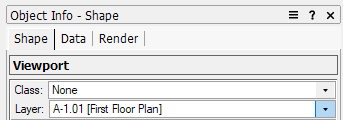

## Appendix C — Sections

When creating a new section, you'll want to have the viewport of the section already placed on a sheet, so you don't have to go back and edit the section marker. (There is a "Create Section Viewport" button, but that's if you're using 3D models.)

### Adding a Section Line/Marker

1. Open the annotation area of the viewport where you want to place the marker.
2. Click on "Section-Elevation Line Tool" in the Tool Sets area.
3. Up top of the drawing area, there will be an info area with "Style" information — be certain this says FirmName Section-Elevation Line.
4. Click on the drawing to place the marker's start, end, and direction. Add more points if desired, then press Enter to end the marker line.
5. Select the section line you just drew and choose the viewport you want it to point to in the "Linked Viewport" dropdown in the Object Info panel.

   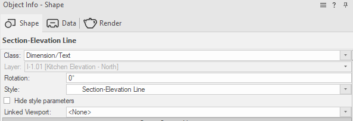

6. If you forgot to do step 2, you can change the style here too.
7. The Drawing Title, Drawing Number, and Sheet Number are automatically updated and will remain current with the information you previously added when you created the section viewport.
8. You're able to grab either of the line's handles to change its length, move it, and rotate it as normal. To change the direction the arrow is pointing, press the "Reverse Direction" button in the Object Info panel.

### Adding a Gap to a Section Line

There's currently no way to do this and keep to our documentation standards. You'll have to add an object (probably a rectangle) and fill it with black to mask out the section line.

### Editing/Adding Information on a Section Marker

Select the section marker and update the information in the Object Info panel.

## Appendix D — Details

Details work in a very similar manner to section markers. They automatically coordinate with the viewport you choose/create. There is a Create Detail Viewport option in the View menu, but if you use it, the crop of the viewport will match the shape you draw and be linked to that shape — if you change the shape/size of the detail marker rectangle, the detail will also change. This can be quite useful, but keep it in mind.

### To Add a Detail Marker

Create your viewport per your desired method, then:

1. Edit the viewport annotation where you want to call out the detail.
2. Select the Detail Callout Tool in the Dim/Notes area of the Tool Sets.
3. Just above the drawing area, verify that the style is "FirmName – Detail Callout Style."

   

4. Click and draw the (default) rounded rectangle around your detail area.
5. With the newly created marker selected, change the Pen settings to Line Type, Line Type-15.
6. In the Object Info panel, select your previously created viewport via the "Linked Viewport" dropdown.
7. Also in the Object Info panel are the settings for the marker position (including custom).

### Editing the Size of the Detail Area

1. Select the detail marker.
2. Select the Reshape Tool (the icon looks like a rectangle with one corner pulled up).
3. Modify your area as needed.
4. Deselect the detail marker.

## Appendix E — Interior Elevation Markers

### To Add an Interior Elevation Marker

1. Edit the annotations for the viewport in question.
2. Double-click on the Interior Elevation Marker from the Tool Set panel.
3. Verify that the style is "FirmName – Interior Elevation Marker Style."
4. Select the Linked Layer that is the sheet where the interior elevation resides.
5. Note that N/S/E/W in the info box means top/bottom/left/right of the marker, not the actual orientation of our building.
6. Check/uncheck the N/S/E/W boxes and select the correct Linked Viewport for the checked boxes.
7. Press **OK**.
8. Click to place your marker.

### To Edit an Interior Elevation Marker

1. Select the marker.
2. Use the Object Info panel to update the information.

## Appendix F — Room Names

### To Add a Room Name Symbol

1. Click on "Room Name" in the Tool Sets panel.
2. Click once to place the special symbol.
3. Click again to set the rotation.
4. Edit the room name and dimensions in the Object Info panel.

## Appendix G — Reference Markers

In case you need one:

### To Add a Reference Marker

1. Click on "Reference Marker" in the Tool Sets panel.
2. Click once to place the symbol portion.
3. Click again to create the extension line — it attaches to the detail shape you created earlier.
4. With the Reference Marker selected, go to the Object Info panel and choose the viewport you want it to point to in the "Linked Viewport" dropdown.

   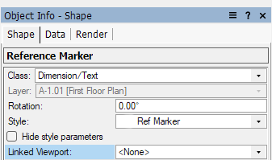

5. Verify that "FirmName Ref Marker" is selected in the Style dropdown.
6. The Drawing Title, Drawing Number, and Sheet Number are automatically updated and will remain current with the information you previously added when you created the detail viewport.
7. You're able to edit the Detail Shape and Reference Marker as usual.

### Editing/Adding Information to a Reference Marker

Select the reference marker and update the information in the Object Info panel.

## Appendix H — Symbols

This document has already gone over a few of the symbols you can add, including Sheet Scales and the Architect Stamp. There are a few more that can be useful, if you wish to use them.

To insert a symbol, click the Symbol Insertion Tool, then select the symbol you want to use from just above the drawing area — the Active Symbol Def dropdown.

### Breaklines

There's a larger one for drawings and a smaller one for dimensions.

- Draw your line, then insert the symbol at the line's center.
- Adjust the symbol scale as necessary.

### Centerline

The standard centerline marker. Draw a line from this symbol and set its Pen to Line Type 11.

### Exterior Elevation Marker

The standard symbol without the lines. There are two locus points for text placement. You'll need to draw the elevation line and set its Pen to Line Type 12. You'll also need to draw a solid line dividing the two text boxes.

Example:

### SD Wall Legend

The basic box that shows what the shading means.

## Appendix I — Special Cases

### How to Move the Title Block

1. Select the title block and press one of the Sheet Data/Project Data buttons in the Object Info panel to bring up the Title Block Border Settings panel.
2. Select "Sheet Border."

   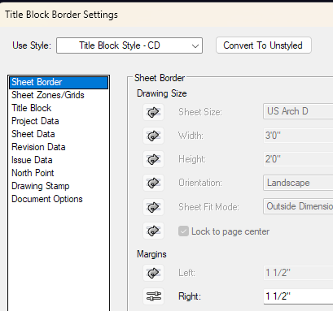

3. Adjust the Right border to a value that works for your sheet.
4. Press **OK**.

## Appendix J — Things You Probably Shouldn't Change/Press/Etc.

### Title Block Manager Button in the Object Info Panel

This changes the title block on multiple/all of the sheets in the entire project. Do not use unless you know what you're doing.

### Title Blocks in the Resource Manager

If you edit the title block from here, you will change the template permanently, for all sheets in the project. It's better to use the available options, make a new one (see the VW documentation), or ask for help.

### Title Block Convert to Unstyled Button

This makes the title block into a one-off version. Please don't, unless you're absolutely certain you want to do this.

---

*Adapted from internal CAD standards documentation; firm name, server addresses, and client references have been replaced with placeholders. See the [repository README](../README.md) for context.*
